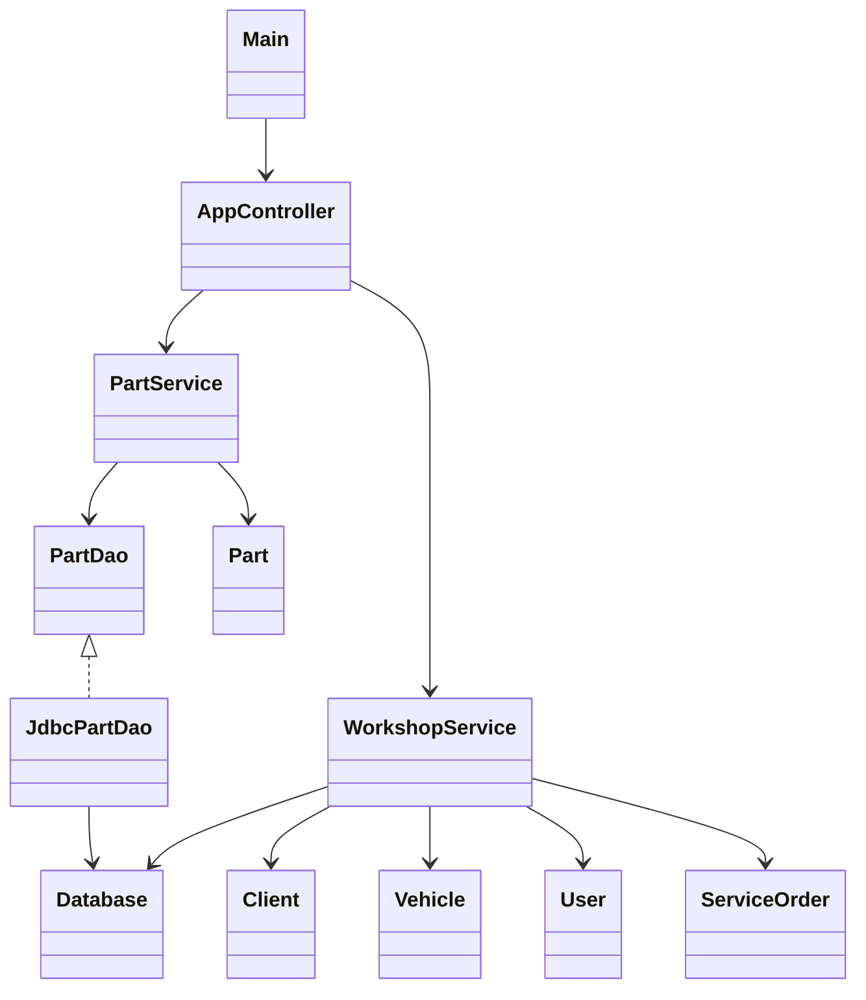
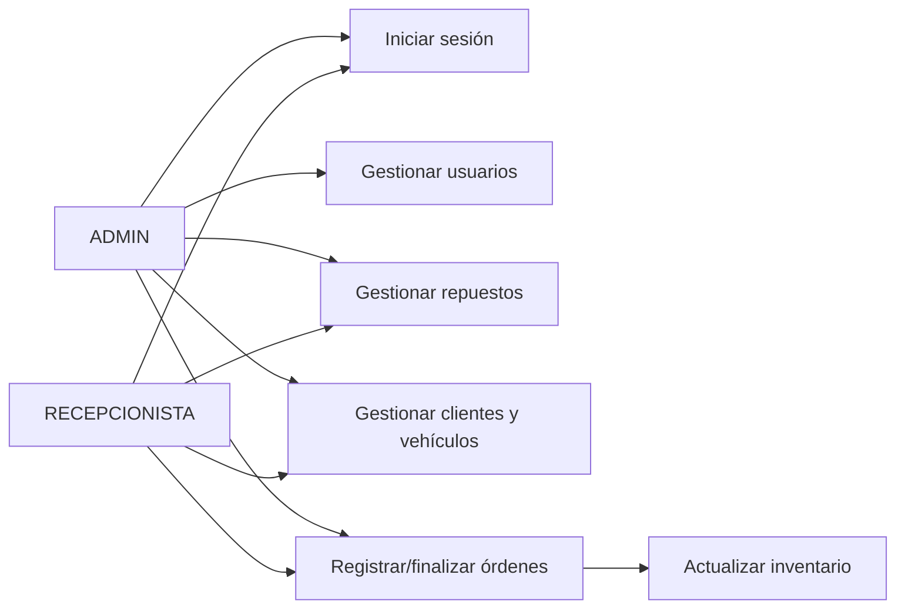

# TallerExpress

Aplicación Java SE con interfaz `JOptionPane` para gestionar repuestos, clientes, vehículos, usuarios y órdenes de servicio. Usa arquitectura por capas (`controller`, `service`, `dao`, `model`), JDBC, excepciones personalizadas y transacciones.

## Requisitos y ejecución

- Java 21 (compatible con Java 17+ ajustando `pom.xml`)
- Maven 3.9+
- Docker y Docker Compose para ejecutar PostgreSQL.

```bash
docker --context default compose up -d
mvn clean compile
mvn exec:java
```

Si su instalación usa Docker Desktop y está iniciado, también puede utilizar simplemente
`docker compose up -d`.

Las credenciales iniciales se configuran localmente mediante `APP_ADMIN_USERNAME` y
`APP_ADMIN_PASSWORD` en el archivo `.env`.

La conexión se configura mediante las variables `DB_URL`, `DB_USER` y `DB_PASSWORD`, o con las
propiedades Java `taller.db.url`, `taller.db.user` y `taller.db.password`.

Copie `.env.example` como `.env`, cambie las contraseñas y cargue sus variables antes de ejecutar
Java:

```bash
set -a
source .env
set +a
mvn exec:java
```

## Funcionalidades

- Repuestos: alta, edición, activación, listado y filtros; código único y control de stock.
- Clientes y vehículos: registro, placa única e historial por cliente.
- Usuarios: autenticación por roles, alta con valores predeterminados y activación/desactivación.
- Órdenes: registro con consumo transaccional de inventario, finalización, costo e historial.
- Trazas CRUD similares a HTTP en consola.

## Arquitectura



## Casos de uso



## Capturas y datos del coder

Agregue aquí las capturas de los diálogos al ejecutar el programa y complete antes de entregar:

- Nombre: Andrea Ahumada
- Clan: _pendiente_
- Correo: _pendiente_
- Documento: _pendiente_
