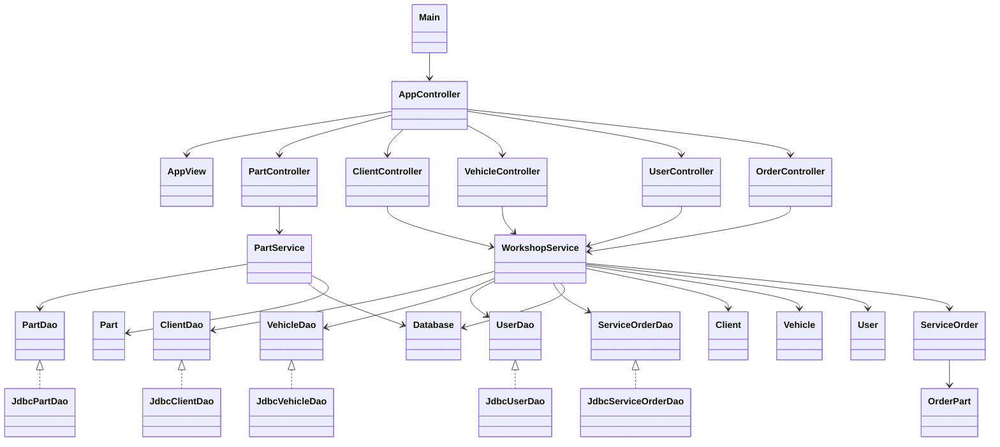
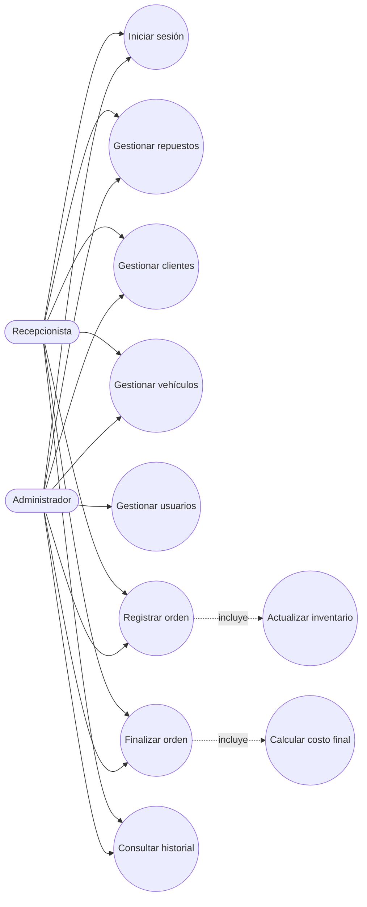

# TallerExpress

Sistema de escritorio para administrar la operación básica de un taller mecánico. Está desarrollado
con Java SE, utiliza ventanas modales de `JOptionPane` y guarda la información en PostgreSQL por
medio de JDBC.

## Índice

1. [Descripción general](#descripción-general)
2. [Funcionalidades](#funcionalidades)
3. [Arquitectura del proyecto](#arquitectura-del-proyecto)
4. [Requisitos previos](#requisitos-previos)
5. [Configuración](#configuración)
6. [Ejecución](#ejecución)
7. [Credenciales iniciales](#credenciales-iniciales)
8. [Pruebas](#pruebas)
9. [Capturas de JOptionPane](#capturas-de-joptionpane)
10. [Diagrama de clases](#diagrama-de-clases)
11. [Diagrama de casos de uso](#diagrama-de-casos-de-uso)
12. [Errores comunes y soluciones](#errores-comunes-y-soluciones)
13. [Detener o reiniciar el sistema](#detener-o-reiniciar-el-sistema)

## Descripción general

TallerExpress centraliza la información de clientes, vehículos, repuestos, usuarios y órdenes de
servicio. La aplicación permite controlar el inventario utilizado en cada orden y consultar el
historial de reparaciones de un vehículo.

El sistema emplea una arquitectura por capas con responsabilidades separadas:

```text
View → Controller → Service → DAO → PostgreSQL
```

- `view`: construye formularios, menús, tablas y mensajes con Swing y `JOptionPane`.
- `controller`: recibe las acciones de las vistas y coordina el flujo de la aplicación.
- `service`: contiene validaciones, reglas de negocio y transacciones.
- `dao`: contiene todas las consultas SQL y convierte los resultados en modelos.
- `model`: representa las entidades del negocio.
- `config`: administra la conexión y crea la estructura inicial de la base de datos.

## Funcionalidades

- Inicio de sesión y autorización por roles.
- Registro, edición, listado y filtrado de repuestos.
- Control de existencias totales y disponibles.
- Registro y consulta de clientes.
- Registro de vehículos asociados a clientes.
- Administración de usuarios por parte de un administrador.
- Registro y finalización de órdenes de servicio.
- Descuento transaccional de los repuestos utilizados.
- Cálculo del costo final de una orden.
- Consulta del historial de servicios por vehículo.

## Arquitectura del proyecto

```text
TallerExpress/
├── docker-compose.yml
├── pom.xml
├── README.md
└── src/
    ├── main/java/com/tallerexpress/
    │   ├── Main.java
    │   ├── config/
    │   ├── controller/
    │   ├── dao/
    │   │   └── impl/
    │   ├── exception/
    │   ├── model/
    │   ├── service/
    │   └── view/
    └── test/java/com/tallerexpress/
```

Los patrones y principios principales son:

- DAO para separar el SQL de los servicios.
- Decorator para asignar propiedades predeterminadas a los usuarios nuevos.
- Arquitectura por capas para separar interfaz, coordinación, negocio y persistencia.
- Uso de interfaces para desacoplar los servicios de las implementaciones JDBC.

## Requisitos previos

Antes de ejecutar el proyecto se necesita:

| Herramienta | Versión recomendada | Comprobación |
|---|---:|---|
| Java JDK | 21 | `java -version` |
| Maven | 3.9 o superior | `mvn -version` |
| Docker | versión reciente | `docker --version` |
| Docker Compose | Compose V2 | `docker compose version` |

PostgreSQL no se instala manualmente: Docker Compose descarga y ejecuta PostgreSQL 17.

## Configuración

### 1. Descargar o copiar el proyecto

Abre una terminal dentro de la carpeta raíz, donde se encuentran `pom.xml` y
`docker-compose.yml`.

```bash
cd TallerExpress
```

Si la ruta contiene espacios, debe escribirse entre comillas:

```bash
cd "/ruta/con espacios/TallerExpress"
```

### 2. Configuración de PostgreSQL

El archivo `docker-compose.yml` contiene una configuración local y educativa:

| Propiedad | Valor |
|---|---|
| Base de datos | `tallerexpress` |
| Usuario PostgreSQL | `tallerexpress` |
| Contraseña PostgreSQL | `tallerexpress` |
| Puerto del computador | `5433` |
| Puerto del contenedor | `5432` |
| Contenedor | `tallerexpress-postgres` |

La aplicación utiliza los mismos valores en `Database.java`:

```text
jdbc:postgresql://localhost:5433/tallerexpress
```

No es necesario crear un archivo `.env` ni cargar variables de entorno.

> Esta configuración facilita la evaluación local. En un sistema de producción las contraseñas
> no deben guardarse directamente en el repositorio.

### 3. Iniciar PostgreSQL

```bash
docker compose up -d
```

Verifica su estado:

```bash
docker compose ps
```

El contenedor debe aparecer como `Up` y posteriormente como `healthy`.

### 4. Compilar

```bash
mvn clean compile
```

## Ejecución

Con PostgreSQL iniciado, ejecuta:

```bash
mvn exec:java
```

El método `main` realiza automáticamente lo siguiente:

1. Configura la apariencia de Swing.
2. Se conecta a PostgreSQL.
3. Crea las tablas si todavía no existen.
4. Crea o actualiza el usuario administrador inicial.
5. Abre el formulario de inicio de sesión.

Para comprobar únicamente la conexión y las tablas, sin abrir ventanas:

```bash
mvn compile exec:java -Dexec.mainClass=com.tallerexpress.config.DatabaseSetup
```

El resultado esperado es:

```text
PostgreSQL conectado correctamente.
Tablas encontradas: 6
```

## Credenciales iniciales

```text
Usuario: admin
Contraseña: admin123
```

El administrador puede ingresar a todos los módulos y gestionar otros usuarios.

## Pruebas

PostgreSQL debe estar iniciado antes de ejecutar las pruebas de integración:

```bash
docker compose up -d
mvn test
```

Maven finaliza con `BUILD SUCCESS` cuando todas las pruebas pasan.

## Capturas de JOptionPane

Las capturas deben obtenerse ejecutando la aplicación real. Guárdalas en
`docs/screenshots/` con estos nombres y elimina la palabra **Pendiente** cuando estén disponibles.

| Pantalla | Archivo esperado | Estado |
|---|---|---|
| Inicio de sesión | `docs/screenshots/01-login.png` | Pendiente |
| Menú principal | `docs/screenshots/02-menu-principal.png` | Pendiente |
| Formulario de repuestos | `docs/screenshots/03-repuestos.png` | Pendiente |
| Formulario de clientes | `docs/screenshots/04-clientes.png` | Pendiente |
| Formulario de vehículos | `docs/screenshots/05-vehiculos.png` | Pendiente |
| Formulario de usuarios | `docs/screenshots/06-usuarios.png` | Pendiente |
| Orden de servicio | `docs/screenshots/07-orden-servicio.png` | Pendiente |

Cuando existan las imágenes, se pueden insertar así:

```markdown


```

## Diagrama de clases



## Diagrama de casos de uso



## Errores comunes y soluciones

### El puerto 5433 ya está ocupado

Mensaje habitual:

```text
ports are not available: bind: address already in use
```

Comprueba qué contenedor utiliza el puerto:

```bash
docker ps --format "table {{.Names}}\t{{.Ports}}"
```

Si `tallerexpress-postgres` ya aparece activo, no inicies otro; ejecuta directamente:

```bash
mvn exec:java
```

Si el puerto pertenece a otro proyecto, detén ese contenedor o cambia `5433` tanto en
`docker-compose.yml` como en `Database.java`.

### Docker no está iniciado

Mensaje habitual:

```text
Cannot connect to the Docker daemon
```

Inicia Docker Desktop o el servicio Docker y vuelve a ejecutar:

```bash
docker compose up -d
```

### Existen varios contextos de Docker

Consulta los contextos disponibles:

```bash
docker context ls
```

Selecciona el motor que deseas utilizar:

```bash
docker context use default
```

Después podrás usar normalmente `docker compose up -d`. En otro computador normalmente no será
necesario cambiar el contexto.

### Error de autenticación de PostgreSQL

Mensaje habitual:

```text
password authentication failed for user "tallerexpress"
```

Puede ocurrir cuando existe un volumen creado anteriormente con otra contraseña. Si no necesitas
conservar esos datos, elimina el contenedor y su volumen y vuelve a crearlos:

```bash
docker compose down -v
docker compose up -d
```

> `down -v` elimina permanentemente los datos guardados por PostgreSQL. No lo ejecutes si necesitas
> conservarlos.

### La conexión fue rechazada

Espera a que PostgreSQL termine de iniciar y revisa su estado:

```bash
docker compose ps
docker compose logs postgres
```

Cuando aparezca `healthy`, vuelve a ejecutar la aplicación.

### Maven o Java no se reconocen

Comprueba la instalación:

```bash
java -version
mvn -version
```

Instala JDK 21 y Maven, y verifica que las variables `JAVA_HOME` y `PATH` estén configuradas en el
sistema operativo.

### No aparece la interfaz gráfica

- Comprueba que estás ejecutando el proyecto en un entorno de escritorio y no en una terminal
  remota sin interfaz gráfica.
- Revisa la consola para identificar errores de conexión.
- Ejecuta primero `DatabaseSetup` para comprobar PostgreSQL sin abrir ventanas.

### Credenciales incorrectas en el login

Utiliza `admin` y `admin123`. Al iniciar, `Database.initialize()` garantiza que la contraseña del
administrador tenga ese valor.

## Detener o reiniciar el sistema

Para detener únicamente la aplicación Java, cierra la ventana o presiona `Ctrl + C` en su terminal.

Para detener PostgreSQL sin borrar los datos:

```bash
docker compose down
```

Para volver a iniciar todo:

```bash
docker compose up -d
mvn exec:java
```

Los datos permanecen almacenados en el volumen `tallerexpress_postgres_data`.

## Datos del autor

- Nombre: Andrea Ahumada
- Clan: pendiente
- Correo: pendiente
- Documento: pendiente
